# aWASoMe 
> An aWASoMe list of all things related to WASM contract development in the Dotsama community.

## Contract language
### ink!
- `ink!` [Github](https://github.com/paritytech/ink)
- `ink!` [Intro](https://paritytech.github.io/ink/)
- `ink!` [Official Documentation](https://ink.substrate.io/)
- `ink!` [Rust doc](https://paritytech.github.io/ink/ink_lang/)
- `ink! examples`
  - Parity [examples](https://github.com/paritytech/ink/tree/master/examples)
  - Openbrush [examples](https://github.com/Supercolony-net/openbrush-contracts/tree/main/examples)
### ask!
- `AssemblyScript` [Github](https://github.com/LimeChain/as-scale-codec) 

## Smart Contract compilers
- `cargo-contract` [Github](https://github.com/paritytech/cargo-contract/) - ink! compiler, uses Rustc compiler
- `solang` [Github](https://github.com/hyperledger-labs/solang) - compiles Solidity smart contracts to WASM

## Contract Interaction
- `polkadot{.js}` [website](https://polkadot.js.org/apps/#/explorer), [Docs](https://polkadot.js.org/docs/api/) - an App to interact with Substrate node and pallet-contracts
- `ContractsUI` [Github](https://github.com/paritytech/contracts-ui), [App](https://paritytech.github.io/canvas-ui/#/instantiate) - simple interaction with Substrate contracts
- `@polkadot/api-contract` [Github](https://github.com/polkadot-js/api) [Docs](https://polkadot.js.org/docs/api-contract) - thin layer on-top of the available API transactions to manage Substrate contracts 
- `Redspot` [Github](https://github.com/patractlabs/redspot) - A Truffle-like toolkit for Substrate node and pallet-contracts
- `Sidecar` [Github](https://github.com/paritytech/substrate-api-sidecar) - REST service that runs alongside Substrate nodes
### Wallets
- `polkadot{.js}` [website](https://polkadot.js.org/extension/) - a browser extension
- `Talisman` [website](https://talisman.xyz/#) - a browser extension

## Test nodes
- `swanky-node` [Github](https://github.com/AstarNetwork/swanky-node) - standalone node supporting pallet-contracts, instant seal and manual seal
- `substrate-contracts-node` [Github](https://github.com/paritytech/substrate-contracts-node) - standalone node supporting pallet-contracts
- `Shibuya parachain` [Network Details](https://docs.astar.network/integration/network-details), [Faucet](https://portal.astar.network/#/assets) - testnet (Parachain on test Relay chain) maintained by Astar

## Support
- [Substrate StackExchange](https://substrate.stackexchange.com/) - ask any smart-contract related question (use tags: ink, contract, smart-contract)
- [Astar Discord](https://discord.gg/Z3nC9U4) - connect with Astar WASM team (Use **Developer Support** channel) 
- [Astar WASM Docs](https://docs.astar.network/wasm-smart-contracts/smart-contract-development) - WASM dev related Docs by Astar
- [Openbrush Contracts](https://github.com/Supercolony-net/openbrush-contracts) - OpenBrush releases
- [Openbrush Docs](https://docs.openbrush.io/) - How to use OpenBrush

## Learning
- [Sub0 Developer Conference](https://sub0.parity.io/) - Semiannual, online and in-person for all
  things Substrate.
- [Substrate Seminar](https://substrate.io/ecosystem/resources/seminar/) - Bi-weekly
  collaborative learning sessions.
- Substrate Seminar: [OpenBrush: a library to build ink! smart contracts](https://www.youtube.com/watch?v=I5OFGNVvzOc&list=PLp0_ueXY_enXRfoaW7sTudeQH10yDvFOS&index=10)
- Figment tutorial: [Build an AMM on Polkadot using Ink!](https://learn.figment.io/tutorials/build-polkadot-amm-using-ink#how-to-interact-with-polkadot-js)

## dApp development
- [Subscan](https://www.subscan.io/) - Multi-network explorer for Substrate-based chains.
- [Subsquid](https://subsquid.io) - An indexing framework (SDK + infrastructure) for WASM
- [DIA Oracle](https://docs.astar.network/wasm-smart-contracts/smart-contract-development) - Oracle for WASM contracts on Astar Network

## Templates
- [Substrate-Front-End](https://github.com/substrate-developer-hub/substrate-front-end-template) - Polkadot-JS API and [React](https://reactjs.org/) app to build front-ends for Substrate-based chains.
