# aWASoMe ]
> An aWASoMe list of all things related to WASM contract development in the Dotsama community.

## Resources
- Astar documentation for WASM contracts
- Swanky development toolkit
- [Openbrush](https://github.com/Supercolony-net/openbrush-contracts)
- List of projects building WASM contracts on Shiden/Astar
## Contract language
### ink!
- `ink!` [Github](https://github.com/paritytech/ink)
- `ink!` [Intro](https://paritytech.github.io/ink/)
- `ink!` [Official Documentation](https://ink.substrate.io/)
- `ink!` [Rust doc](https://paritytech.github.io/ink/ink_lang/)
- `ink! examples`
  - Parity [examples](https://github.com/paritytech/ink/tree/master/examples)
  - Openbrush [examples](https://github.com/Supercolony-net/openbrush-contracts/tree/main/examples)
### ask!
- AssemblyScript [Github](https://github.com/LimeChain/as-scale-codec) 

## Smart Contract compilers
- `cargo-contract` [Github](https://github.com/paritytech/cargo-contract/), uses Rustc compiler
- `solang`[Github](https://github.com/hyperledger-labs/solang) - compiles Solidity smart contracts to WASM

## Contract Interaction
- `polkadot{.js}` [website](https://polkadot.js.org/apps/#/explorer), [Docs](https://polkadot.js.org/docs/api/) - an App to interact with Substrate node and pallet-contracts
  - `ContractsUI` [Github](https://github.com/paritytech/contracts-ui) [App](https://paritytech.github.io/canvas-ui/#/instantiate) simple interaction with Substrate contracts
  - `@polkadot/api-contract` [Docs](https://polkadot.js.org/docs/api-contract) thin layer on-top of the available API transactions to manage Substrate contracts 
### Wallets
- `polkadot{.js}` [website](https://polkadot.js.org/extension/), a browser extension
- `Talisman` [website](https://talisman.xyz/#)

## Support
- Substrate [StackExchange](https://substrate.stackexchange.com/) (use tags: ink, contract, smart-contract)
- Astar [Discord](https://discord.gg/Z3nC9U4) (Use **Developer Support** channel)
- Astar [WASM Docs](https://docs.astar.network/wasm-smart-contracts/smart-contract-development)

## Learning
- [Sub0 Developer Conference](https://sub0.parity.io/) - Semiannual, online and in-person for all
  things Substrate.
- [Substrate Seminar](https://substrate.io/ecosystem/resources/seminar/) - Bi-weekly
  collaborative learning sessions.

## Videos

- Substrate Seminar: [OpenBrush: a library to build ink! smart contracts](https://www.youtube.com/watch?v=I5OFGNVvzOc&list=PLp0_ueXY_enXRfoaW7sTudeQH10yDvFOS&index=10)

## Templates
- [Front-End](https://github.com/substrate-developer-hub/substrate-front-end-template) - Polkadot-JS API and [React](https://reactjs.org/) app to build front-ends for Substrate-based chains.

## Client Libraries

- [.Net API](https://github.com/usetech-llc/polkadot_api_dotnet) - Maintained by [Usetech](https://usetech.com/blockchain/).
- [.NET Standard API](https://github.com/dotmog/SubstrateNetApi) - Used in [nuget](https://www.nuget.org/packages/SubstrateNetApi/), and [Unity 3D integration example](https://github.com/darkfriend77/Unity3DExample); Maintained by [DOTMog](https://dotmog.com/).
- [`go-substrate-gen`](https://github.com/Aphoh/go-substrate-gen) - Generate go (de)serialization/client code from substrate metadata.
- [`sube`](https://github.com/virto-network/sube) - Lightweight Rust client library and CLI with support for type information.
- [`subxt`](https://github.com/paritytech/substrate-subxt) - Official Rust client.
- [C++ API](https://github.com/usetech-llc/polkadot_api_cpp) - Maintained by Usetech.
- [Go RPC Client](https://github.com/centrifuge/go-substrate-rpc-client/) - Maintained by [Centrifuge](https://centrifuge.io/).
- [Kotlin Client](https://github.com/NodleCode/substrate-client-kotlin) - Maintained by [Nodle.io](https://github.com/NodleCode).
- [Polkadot-JS API](https://github.com/polkadot-js/api/) - Semi-official JavaScript library for Substrate-based chains.
- [Python Interface](https://github.com/polkascan/py-substrate-interface) - Maintained by [Polkascan Foundation](https://polkascan.org/).
- [Rust API Client](https://github.com/scs/substrate-api-client) - Rust client maintained by [Supercomputing Systems AG](https://www.scs.ch/).
- [Subscan Go Utilities](https://github.com/itering/subscan-essentials) - SS58 and more, developed by Subscan.

## Mobile

- [Fearless Utils Android](https://github.com/soramitsu/fearless-utils-Android) - Android Substrate tools.
- [Fearless Utils iOS](https://github.com/soramitsu/fearless-utils-iOS) - iOS Substrate tools.
- [Polkadot-Dart](https://github.com/Pocket4D/Polkadot-Dart) - Dart Substrate API.
- [PolkaWallet SDK](https://github.com/polkawallet-io/sdk) - Flutter SDK for Substrate-based App.
- [React-Native-Substrate-Sign](https://github.com/paritytech/react-native-substrate-sign) - Rust library for React Native.

## Tools

- [`offchain::ipfs`](https://rs-ipfs.github.io/offchain-ipfs-manual/) - Substrate infused with [IPFS](https://ipfs.io/).
- [`polkadot-js-bundle`](https://github.com/shawntabrizi/polkadot-js-bundle) - A standalone JS bundle that contains Polkadot{JS} libraries.
- [`polkadot-launch`](https://github.com/shawntabrizi/polkadot-launch) - Simple CLI tool to launch a local Polkadot test network.
- [`substrate-js-utils`](https://github.com/shawntabrizi/substrate-js-utilities) - A set of useful JavaScript utilities for Substrate that uses the Polkadot{JS} API; Also [deployed as a website](https://www.shawntabrizi.com/substrate-js-utilities/).
- [`subwasm`](https://github.com/chevdor/subwasm) - CLI to inspect a runtime WASM blob offline. It shows information, metadata and can compare runtimes. It can also help you fetch a runtime directly from a node.
- [Europa](https://github.com/patractlabs/europa) - A sandbox for the Substrate runtime execution environment.
- [Jupiter](https://github.com/patractlabs/jupiter) - Testnet for smart contracts written for the FRAME Contracts pallet and ink!.
- [Polkadot Tool Index](https://wiki.polkadot.network/docs/build-tools-index) - List of tools available for your development with Polkadot and any Substrate chain including Block Explorers, Wallets, Network Monitoring & Reporting, Clients, Benchmarking, Fuzzing, Forking, SCALE Codec, CLI Tools and much more.
- [Polkadot-JS Apps UI](https://polkadot.js.org/apps/) - Semi-official block explorer & front-end for Substrate-based chains.
- [Polkadot-JS Extension](https://github.com/polkadot-js/extension) - Browser extension for interacting with Substrate-based chains.
- [Redspot](https://github.com/patractlabs/redspot) - A [Truffle](https://www.trufflesuite.com/truffle)-like toolkit for smart contracts for the FRAME Contracts pallet and ink!.
- [Sidecar](https://github.com/paritytech/substrate-api-sidecar) - REST service that runs alongside Substrate nodes.
- [SS58 Transform](https://polkadot.subscan.io/tools/ss58_transform) - Display key's addressees with all SS58 prefixes.
- [Subkey](https://substrate.dev/docs/en/knowledgebase/integrate/subkey) - Command line utility for working with cryptographic keys.
- [SubQuery](https://subquery.network) - A GraphQL indexer and query service that allows users to easily create indexed data sources and host them online for free.
- [Subscan](https://www.subscan.io/) - Multi-network explorer for Substrate-based chains.
- [Subsquid](https://subsquid.io) - An indexing framework (SDK + infrastructure) to quickly and easily turn Substrate and EVM on-chain data into APIs and host them.
- [Substrate Graph](https://github.com/playzero/substrate-graph) - GraphQL indexer for Substrate-based chains.

## Products and Services

- [OnFinality](https://onfinality.io) - Free and paid services to shared Substrate based nodes.
- BWareLabs

- [AssemblyScript](https://github.com/LimeChain/as-scale-codec) - Maintained by LimeChain.
